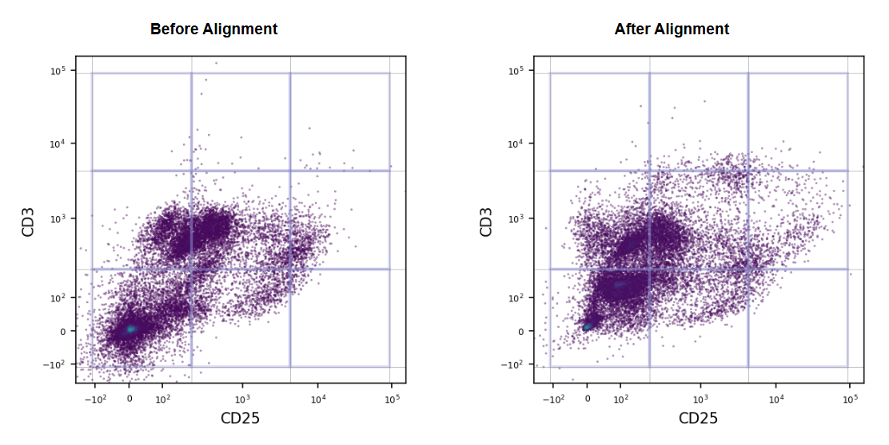

# Voxelcoder Flow Cytometry Batch Alignment & Voxel Analysis: Command-Line Interface

A command-line tool for aligning flow cytometry batches using autoencoder neural networks and generating voxel occupancy analysis. This tool processes FCS files to correct for batch effects, then performs comprehensive voxel analysis for ultra-sensitive classification of disease phenotypes.



## Superior batch alignment and hyper-dimensional cytometry representations allow ultra-sensitive classification of disease phenotypes

https://www.biorxiv.org/content/biorxiv/early/2025/07/31/2025.07.28.666458.full.pdf

## Two-Step Workflow

This tool requires a two-step process:

1. **Batch Alignment**: Correct for batch effects using autoencoders (`batch_align.py`)
2. **Voxel Analysis**: Generate voxel occupancy analysis from aligned data (`voxel_analysis.py`)

## Quick Start

### Step 1: Setup and Configuration

1. **Install Dependencies**
   ```bash
   pip install -r requirements.txt
   ```

2. **Prepare Your Data Structure**
   ```
   data/
   ├── batch_A/          # Reference batch
   │   ├── file1.fcs
   │   ├── file2.fcs
   │   └── ...
   ├── batch_B/          # Target batch 1
   │   ├── file1.fcs
   │   └── ...
   └── batch_C/          # Target batch 2
       └── ...
   ```

3. **Create Configuration File**
   ```bash
   cp config.yaml my_experiment_config.yaml
   # Edit my_experiment_config.yaml with your paths and markers
   ```

4. **Validate Configuration**
   ```bash
   python batch_align.py --config my_experiment_config.yaml --validate
   ```

### Step 2: Run Batch Alignment

5. **Perform Batch Alignment**
   ```bash
   python batch_align.py --config my_experiment_config.yaml
   ```

   This creates aligned FCS files in the output directory structure:
   ```
   results/
   ├── models/
   │   └── autoencoder.pt
   ├── aligned_data/
   │   ├── batch_A/
   │   │   ├── file1.fcs
   │   │   └── file2.fcs
   │   ├── batch_B/
   │   │   └── ...
   │   └── batch_C/
   │       └── ...
   └── summary_report.json
   ```

### Step 3: Run Voxel Analysis

6. **Generate Voxel Occupancy Analysis**
   ```bash
   python voxel_analysis.py --config my_experiment_config.yaml --aligned-data ./results/aligned_data
   ```

   This produces comprehensive voxel analysis results:
   ```
   results/
   ├── voxel_analysis_results.csv    # Main results table
   └── voxel_analysis_results.pkl    # Pickle format for Python
   ```

## Configuration

The tool uses a single YAML configuration file for both steps. Here's a minimal example:

```yaml
experiment:
  name: "my_experiment"
  output_dir: "./results"

data:
  reference_batch: "./data/batch_A"
  target_batches:
    - "./data/batch_B"
    - "./data/batch_C"

channels:
  selected_markers:
    - "CD4"
    - "CD8"
    - "CD3"
    # ... add your markers here
  
  # Optional: include scatter channels in aligned FCS output
  scatter_channels:
    - "FSC-A"
    - "SSC-A"

compensation:
  method: "spill"  # or "none" or "/path/to/comp.csv"

export:
  fcs_files: true  # Required for voxel analysis step
```

### Key Configuration Sections

- **experiment**: Basic experiment settings and output location
- **data**: Paths to reference and target batch directories
- **channels**: List of marker names and optional scatter channels
- **compensation**: Compensation method configuration
- **processing**: Cell count limits and processing parameters
- **model**: Neural network architecture and training parameters
- **hardware**: Device selection (GPU/CPU)
- **export**: Must include `fcs_files: true` for voxel analysis
- **logging**: Logging configuration

## Command Line Options

### Batch Alignment (`batch_align.py`)

```bash
python batch_align.py --config CONFIG [OPTIONS]

Options:
  --config, -c PATH     Path to YAML configuration file (required)
  --validate           Validate configuration without running
  --dry-run            Show processing plan without running
  --skip-validation    Skip pre-flight validation (not recommended)
  --verbose, -v        Enable verbose output
  --help              Show help message
```

### Voxel Analysis (`voxel_analysis.py`)

```bash
python voxel_analysis.py --config CONFIG --aligned-data PATH [OPTIONS]

Options:
  --config, -c PATH     Path to YAML configuration file (required)
  --aligned-data PATH   Path to aligned_data directory from batch alignment
  --verbose, -v        Enable verbose output
  --help              Show help message
```

## Understanding Voxel Analysis

The voxel analysis step generates all possible 2- and 3-marker combinations with LOW, MED, HIGH expression intervals:

- **LOW**: Expression < 0.3
- **MED**: Expression 0.3-0.6  
- **HIGH**: Expression ≥ 0.6

The output CSV contains the proportion of cells in each voxel combination for every sample.

## Output Structure

### After Batch Alignment
```
results/
├── models/
│   └── autoencoder.pt              # Trained model
├── aligned_data/
│   ├── reference_data.npy          # Reference dataset
│   ├── batch_A/                   # Reference batch results
│   │   ├── file1.fcs              # Aligned FCS files
│   │   └── file2.fcs
│   ├── batch_B/                   # Target batch results
│   └── batch_C/
├── logs/                          # Log files (if configured)
└── summary_report.json            # Batch alignment report
```

### After Voxel Analysis
```
results/
├── ... (previous files)
├── voxel_analysis_results.csv     # Main results: samples × voxel combinations
└── voxel_analysis_results.pkl     # Same data in pickle format
```

## Examples

### Complete Workflow
```bash
# 1. Validate configuration
python batch_align.py --config config.yaml --validate

# 2. Run batch alignment
python batch_align.py --config config.yaml

# 3. Generate voxel analysis
python voxel_analysis.py --config config.yaml --aligned-data ./results/aligned_data
```

### With Verbose Output
```bash
python batch_align.py --config config.yaml --verbose
python voxel_analysis.py --config config.yaml --aligned-data ./results/aligned_data --verbose
```

### Dry Run (Show Plan)
```bash
python batch_align.py --config config.yaml --dry-run
```

## Troubleshooting

### Common Issues

1. **Marker Not Found**
   ```
   Error: Markers not found in reference batch: ['CD45RA']
   Available markers: ['CD45 RA', 'CD33', ...]
   ```
   **Solution**: Check marker names exactly match those in your FCS files

2. **FCS Export Not Enabled**
   ```
   Error: No FCS files found in aligned data directory
   ```
   **Solution**: Ensure `export.fcs_files: true` in your config for batch alignment

3. **CUDA Out of Memory**
   ```
   RuntimeError: CUDA out of memory
   ```
   **Solution**: Reduce `batch_size` or `inference_batch_size` in config

4. **No Aligned Data Found**
   ```
   Error: No batch directories found in aligned_data
   ```
   **Solution**: Run batch alignment step first, ensure it completed successfully

## Performance Tips

- **GPU Usage**: Both steps benefit from GPU acceleration if available
- **Memory Management**: Adjust batch sizes based on available memory
- **File Sizes**: Consider `max_cells_per_file` to limit memory usage for large files
- **Parallel Processing**: The voxel analysis uses batched GPU processing for efficiency

## Requirements

- Python 3.7+
- PyTorch 1.9+ (with CUDA support recommended)
- FlowKit 1.0+
- NumPy, Pandas, PyYAML
- CUDA (optional, for GPU acceleration)
